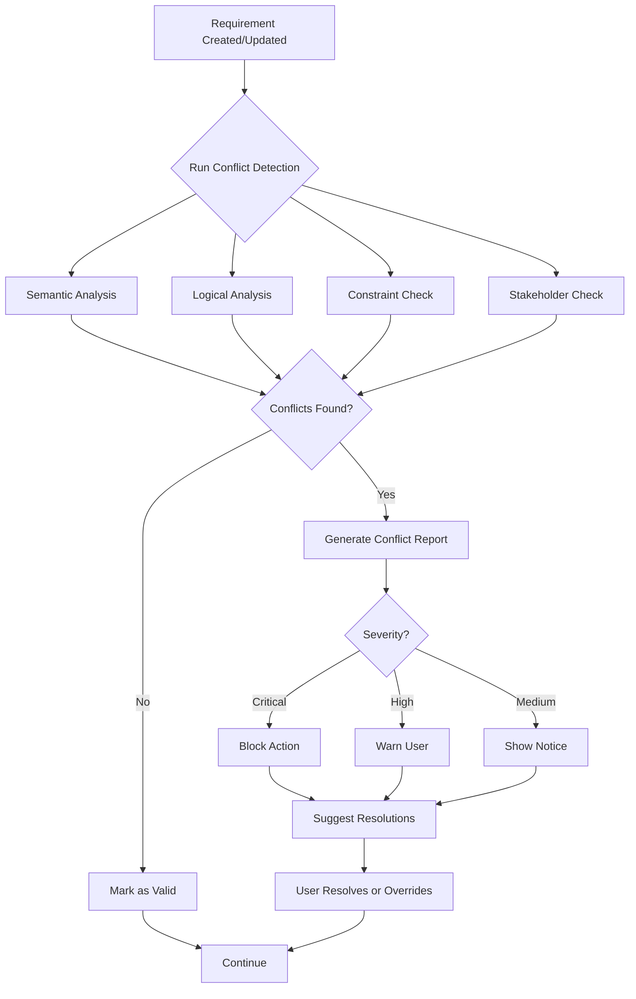

# Automated Conflict Detection System - Detailed Design

**Date:** 2025-11-19
**Status:** Design Phase
**Priority:** CRITICAL
**Dependencies:** RAG integration, Requirements index

---

## 1. Overview

### 1.1 Purpose

Build an **automated multi-dimensional conflict detection system** that identifies:
- Semantic conflicts (contradictory statements)
- Logical conflicts (circular dependencies, orphans)
- Constraint violations (business rules)
- Stakeholder conflicts (competing priorities)
- Technical conflicts (implementation incompatibilities)

### 1.2 Goals

- ✅ Detect conflicts **before** requirements are approved
- ✅ Provide **actionable** resolution suggestions
- ✅ Minimize **false positives** (< 10%)
- ✅ Process conflicts in **< 2 seconds** per requirement
- ✅ Support **incremental** detection (only check changed requirements)

---

## 2. Conflict Types & Detection Methods

### 2.1 Semantic Conflicts

**Definition:** Requirements that contradict each other in meaning.

#### Examples:

| Requirement A | Requirement B | Conflict |
|---------------|---------------|----------|
| "Email verification is mandatory" | "Email verification is optional" | Direct contradiction |
| "Response time must be < 2 seconds" | "Response time must be < 5 seconds" | Specification conflict (which takes precedence?) |
| "Only admins can delete users" | "Any user can delete their own account" | Permission conflict |
| "System uses OAuth authentication" | "System uses SAML authentication" | Technical approach conflict |

#### Detection Algorithm:

```python
class SemanticConflictDetector:
    """
    Uses NLP and semantic similarity to detect contradictory requirements.
    """

    def __init__(self):
        self.negation_patterns = [
            "not", "no", "never", "cannot", "must not",
            "prohibited", "forbidden", "denied"
        ]
        self.contradiction_pairs = [
            ("mandatory", "optional"),
            ("required", "optional"),
            ("always", "never"),
            ("must", "must not"),
            ("public", "private"),
            ("enabled", "disabled"),
        ]

    def detect_semantic_conflict(self, req1, req2) -> dict:
        """
        Multi-stage semantic conflict detection:

        Stage 1: Keyword-based detection
        - Check for contradiction pairs in same context
        - Look for negation patterns

        Stage 2: Sentence embedding similarity
        - Use RAG/embeddings to find semantically similar requirements
        - If similarity > 0.8 but contains negation → conflict

        Stage 3: Numeric constraint conflicts
        - Extract numeric values (< 2 seconds vs < 5 seconds)
        - Check for overlapping/conflicting ranges

        Stage 4: Entity-relationship conflicts
        - Extract entities (users, admins, guests)
        - Check for conflicting permissions/actions on same entity
        """

        conflicts = []

        # Stage 1: Keyword detection
        if self._has_contradiction_keywords(req1, req2):
            conflicts.append({
                "type": "keyword_contradiction",
                "severity": "high",
                "confidence": 0.9,
            })

        # Stage 2: Embedding similarity + negation
        similarity = self._compute_similarity(req1, req2)
        if similarity > 0.8 and self._contains_negation_of_other(req1, req2):
            conflicts.append({
                "type": "semantic_negation",
                "severity": "critical",
                "confidence": 0.95,
            })

        # Stage 3: Numeric conflicts
        numeric_conflict = self._detect_numeric_conflict(req1, req2)
        if numeric_conflict:
            conflicts.append({
                "type": "numeric_constraint",
                "severity": "medium",
                "confidence": 0.85,
                "details": numeric_conflict
            })

        # Stage 4: Entity-action conflicts
        entity_conflict = self._detect_entity_conflict(req1, req2)
        if entity_conflict:
            conflicts.append({
                "type": "entity_permission",
                "severity": "high",
                "confidence": 0.8,
                "details": entity_conflict
            })

        return {
            "has_conflict": len(conflicts) > 0,
            "conflicts": conflicts,
            "max_severity": self._max_severity(conflicts)
        }

    def _has_contradiction_keywords(self, req1, req2):
        """Check for contradiction keyword pairs."""
        req1_lower = req1['summary'].lower() + " " + req1.get('details', '').lower()
        req2_lower = req2['summary'].lower() + " " + req2.get('details', '').lower()

        for word1, word2 in self.contradiction_pairs:
            if word1 in req1_lower and word2 in req2_lower:
                # Check if they refer to the same concept
                if self._same_context(req1_lower, req2_lower, word1, word2):
                    return True
        return False

    def _compute_similarity(self, req1, req2):
        """Use RAG embeddings to compute semantic similarity."""
        # Use Open WebUI's vector database
        embedding1 = get_embedding(req1['summary'] + " " + req1.get('details', ''))
        embedding2 = get_embedding(req2['summary'] + " " + req2.get('details', ''))
        return cosine_similarity(embedding1, embedding2)

    def _contains_negation_of_other(self, req1, req2):
        """Check if one requirement negates the other."""
        req1_text = req1['summary'].lower()
        req2_text = req2['summary'].lower()

        # Check if req1 contains negation patterns and req2's key concepts
        for pattern in self.negation_patterns:
            if pattern in req1_text:
                # Extract key concepts from req2
                req2_concepts = self._extract_concepts(req2_text)
                if any(concept in req1_text for concept in req2_concepts):
                    return True

        return False

    def _detect_numeric_conflict(self, req1, req2):
        """Detect conflicting numeric constraints."""
        import re

        # Extract numeric constraints (e.g., "< 2 seconds", "> 1000 users")
        pattern = r'([<>=]+)\s*(\d+(?:\.\d+)?)\s*(\w+)'

        req1_constraints = re.findall(pattern, req1['summary'] + " " + req1.get('details', ''))
        req2_constraints = re.findall(pattern, req2['summary'] + " " + req2.get('details', ''))

        for op1, val1, unit1 in req1_constraints:
            for op2, val2, unit2 in req2_constraints:
                if unit1 == unit2:  # Same unit (seconds, users, etc.)
                    # Check for conflicting constraints
                    if self._constraints_conflict(op1, float(val1), op2, float(val2)):
                        return {
                            "constraint1": f"{op1} {val1} {unit1}",
                            "constraint2": f"{op2} {val2} {unit2}",
                            "reason": "Conflicting numeric constraints on same metric"
                        }

        return None

    def _constraints_conflict(self, op1, val1, op2, val2):
        """Check if two numeric constraints conflict."""
        # Examples:
        # "< 2" and "> 5" → conflict (impossible to satisfy both)
        # "< 5" and "< 2" → not conflict (2 is stricter, but not impossible)
        # "= 5" and "= 10" → conflict (cannot be both)

        if op1 == '=' and op2 == '=' and val1 != val2:
            return True  # Cannot be two different exact values

        if op1 == '<' and op2 == '>':
            if val1 <= val2:
                return True  # Impossible range

        if op1 == '>' and op2 == '<':
            if val1 >= val2:
                return True  # Impossible range

        return False

    def _detect_entity_conflict(self, req1, req2):
        """Detect conflicting permissions/actions on same entity."""
        # Extract entity-action pairs (e.g., "admin can delete", "user cannot delete")

        entities = ["user", "admin", "guest", "customer", "manager"]
        actions = ["create", "read", "update", "delete", "view", "edit", "access"]
        permissions = ["can", "cannot", "may", "must", "must not"]

        req1_rules = self._extract_permission_rules(req1, entities, actions, permissions)
        req2_rules = self._extract_permission_rules(req2, entities, actions, permissions)

        # Compare rules for same entity-action pairs
        for (entity1, action1, perm1) in req1_rules:
            for (entity2, action2, perm2) in req2_rules:
                if entity1 == entity2 and action1 == action2:
                    # Same entity and action, check permission conflict
                    if self._permissions_conflict(perm1, perm2):
                        return {
                            "entity": entity1,
                            "action": action1,
                            "permission1": perm1,
                            "permission2": perm2,
                            "reason": f"Conflicting permissions for {entity1} to {action1}"
                        }

        return None

    def _permissions_conflict(self, perm1, perm2):
        """Check if two permissions conflict."""
        positive = ["can", "may", "must"]
        negative = ["cannot", "may not", "must not"]

        if perm1 in positive and perm2 in negative:
            return True
        if perm1 in negative and perm2 in positive:
            return True

        return False
```

---

### 2.2 Logical Conflicts (Dependency Issues)

**Definition:** Problems in the dependency graph structure.

#### Types:

**Circular Dependencies:**
```
REQ-001 depends on REQ-005
REQ-005 depends on REQ-012
REQ-012 depends on REQ-001  ← Circular!
```

**Missing Dependencies:**
```
REQ-007 references REQ-099 (doesn't exist)
```

**Orphaned Requirements:**
```
REQ-023 has no parent and no children (isolated)
```

**Broken Chains:**
```
Epic → Feature → [missing story] → Task
```

#### Detection Algorithm:

```python
class LogicalConflictDetector:
    """
    Graph-based dependency conflict detection.
    """

    def build_dependency_graph(self, requirements):
        """Build directed graph of requirement dependencies."""
        import networkx as nx

        G = nx.DiGraph()

        for req in requirements:
            req_id = req['id']
            G.add_node(req_id, data=req)

            # Add dependency edges
            for dep in req.get('dependencies', {}).get('blocked_by', []):
                G.add_edge(dep, req_id, type='blocks')

            # Add hierarchy edges
            if req.get('parent_id'):
                G.add_edge(req['parent_id'], req_id, type='parent-child')

        return G

    def detect_circular_dependencies(self, G):
        """Detect cycles in dependency graph."""
        import networkx as nx

        try:
            cycles = list(nx.simple_cycles(G))
            return [
                {
                    "type": "circular_dependency",
                    "severity": "critical",
                    "cycle": cycle,
                    "path": " → ".join(cycle) + f" → {cycle[0]}",
                    "suggestion": f"Break the cycle by removing dependency between {cycle[-1]} and {cycle[0]}"
                }
                for cycle in cycles
            ]
        except:
            return []

    def detect_missing_dependencies(self, G, requirements):
        """Detect references to non-existent requirements."""
        all_ids = {req['id'] for req in requirements}
        missing = []

        for req in requirements:
            req_id = req['id']

            # Check blocked_by dependencies
            for dep in req.get('dependencies', {}).get('blocked_by', []):
                if dep not in all_ids:
                    missing.append({
                        "type": "missing_dependency",
                        "severity": "high",
                        "req_id": req_id,
                        "missing_id": dep,
                        "suggestion": f"Create {dep} or remove the dependency from {req_id}"
                    })

            # Check parent_id
            parent = req.get('parent_id')
            if parent and parent not in all_ids:
                missing.append({
                    "type": "missing_parent",
                    "severity": "high",
                    "req_id": req_id,
                    "missing_id": parent,
                    "suggestion": f"Create {parent} or remove parent reference from {req_id}"
                })

        return missing

    def detect_orphaned_requirements(self, G):
        """Detect isolated requirements (no connections)."""
        import networkx as nx

        orphans = []
        for node in G.nodes():
            if G.in_degree(node) == 0 and G.out_degree(node) == 0:
                orphans.append({
                    "type": "orphaned_requirement",
                    "severity": "medium",
                    "req_id": node,
                    "suggestion": f"Link {node} to a parent epic/feature or add dependencies"
                })

        return orphans

    def detect_priority_conflicts(self, G, requirements):
        """Detect high-priority items depending on low-priority items."""
        conflicts = []

        priority_order = {"critical": 4, "high": 3, "medium": 2, "low": 1}

        for req in requirements:
            req_id = req['id']
            req_priority = priority_order.get(req.get('priority', 'medium'), 2)

            # Check dependencies
            for dep_id in req.get('dependencies', {}).get('blocked_by', []):
                dep = next((r for r in requirements if r['id'] == dep_id), None)
                if dep:
                    dep_priority = priority_order.get(dep.get('priority', 'medium'), 2)

                    # High priority blocked by low priority
                    if req_priority > dep_priority + 1:  # More than 1 level difference
                        conflicts.append({
                            "type": "priority_conflict",
                            "severity": "medium",
                            "req_id": req_id,
                            "req_priority": req['priority'],
                            "blocking_req": dep_id,
                            "blocking_priority": dep['priority'],
                            "suggestion": f"Consider raising priority of {dep_id} or reducing priority of {req_id}"
                        })

        return conflicts

    def find_critical_path(self, G, target_req):
        """Find critical path to implement a requirement."""
        import networkx as nx

        # Find all dependencies (transitive)
        predecessors = nx.ancestors(G, target_req)

        # Build subgraph of dependencies
        subgraph = G.subgraph([target_req] + list(predecessors))

        # Find longest path (critical path)
        try:
            critical_path = nx.dag_longest_path(subgraph)
            return {
                "target": target_req,
                "critical_path": critical_path,
                "length": len(critical_path),
                "path_display": " → ".join(critical_path)
            }
        except:
            return None
```

---

### 2.3 Constraint Violations (Business Rules)

**Definition:** Requirements that violate organizational policies or best practices.

#### Example Rules:

```python
class ConstraintViolationDetector:
    """
    Check requirements against business rules and best practices.
    """

    def __init__(self):
        self.rules = [
            {
                "id": "RULE-001",
                "name": "Security requirements must be high priority",
                "check": self._check_security_priority,
                "severity": "high"
            },
            {
                "id": "RULE-002",
                "name": "Implemented requirements must have test coverage",
                "check": self._check_test_coverage,
                "severity": "critical"
            },
            {
                "id": "RULE-003",
                "name": "User stories must have acceptance criteria",
                "check": self._check_acceptance_criteria,
                "severity": "medium"
            },
            {
                "id": "RULE-004",
                "name": "API requirements must document rate limits",
                "check": self._check_api_rate_limits,
                "severity": "medium"
            },
            {
                "id": "RULE-005",
                "name": "GDPR requirements must be approved by legal",
                "check": self._check_gdpr_approval,
                "severity": "critical"
            },
            {
                "id": "RULE-006",
                "name": "Requirements affecting payments must include fraud checks",
                "check": self._check_payment_fraud,
                "severity": "high"
            },
        ]

    def validate_requirement(self, requirement):
        """Run all constraint checks on a requirement."""
        violations = []

        for rule in self.rules:
            result = rule['check'](requirement)
            if result['violated']:
                violations.append({
                    "rule_id": rule['id'],
                    "rule_name": rule['name'],
                    "severity": rule['severity'],
                    "details": result['details'],
                    "suggestion": result['suggestion']
                })

        return violations

    def _check_security_priority(self, req):
        """Security requirements should be high/critical priority."""
        area = req.get('area', '').lower()
        priority = req.get('priority', 'medium').lower()

        security_keywords = ['security', 'authentication', 'authorization', 'encryption', 'auth']

        is_security = any(kw in area for kw in security_keywords) or \
                      any(kw in req['title'].lower() for kw in security_keywords)

        if is_security and priority not in ['high', 'critical']:
            return {
                "violated": True,
                "details": f"Security requirement has priority '{priority}'",
                "suggestion": "Raise priority to 'high' or 'critical'"
            }

        return {"violated": False}

    def _check_test_coverage(self, req):
        """Implemented requirements should have test references."""
        status = req.get('status', '').lower()

        if status == 'implemented':
            # Check if requirement has test references
            details = req.get('details', '').lower()
            has_tests = 'test' in details or \
                        req.get('examples') or \
                        req.get('test_ids')

            if not has_tests:
                return {
                    "violated": True,
                    "details": "Implemented requirement has no test coverage",
                    "suggestion": "Add test case references or Gherkin scenarios"
                }

        return {"violated": False}

    def _check_acceptance_criteria(self, req):
        """User stories should have clear acceptance criteria."""
        req_type = req.get('type', '').lower()

        if 'story' in req_type or 'user-story' in req_type:
            details = req.get('details', '')
            examples = req.get('examples', [])

            has_criteria = len(details) > 50 or len(examples) > 0

            if not has_criteria:
                return {
                    "violated": True,
                    "details": "User story lacks acceptance criteria",
                    "suggestion": "Add detailed acceptance criteria or Gherkin scenarios"
                }

        return {"violated": False}

    def _check_api_rate_limits(self, req):
        """API requirements should document rate limits."""
        area = req.get('area', '').lower()
        title = req.get('title', '').lower()

        is_api = 'api' in area or 'api' in title or 'endpoint' in title

        if is_api:
            details = req.get('details', '').lower()
            has_rate_limit = 'rate limit' in details or \
                             'throttle' in details or \
                             'requests per' in details

            if not has_rate_limit:
                return {
                    "violated": True,
                    "details": "API requirement doesn't specify rate limits",
                    "suggestion": "Add rate limiting requirements (requests/sec, etc.)"
                }

        return {"violated": False}

    def _check_gdpr_approval(self, req):
        """GDPR-related requirements need legal approval."""
        keywords = ['gdpr', 'privacy', 'personal data', 'right to be forgotten', 'data export']

        content = (req.get('title', '') + " " + req.get('details', '')).lower()
        is_gdpr = any(kw in content for kw in keywords)

        if is_gdpr:
            approvers = req.get('stakeholders', {}).get('approvers', [])
            legal_approved = any('legal' in appr.get('name', '').lower() for appr in approvers)

            if not legal_approved:
                return {
                    "violated": True,
                    "details": "GDPR requirement not approved by legal team",
                    "suggestion": "Get legal team approval before implementation"
                }

        return {"violated": False}

    def _check_payment_fraud(self, req):
        """Payment requirements should include fraud prevention."""
        keywords = ['payment', 'transaction', 'checkout', 'purchase', 'billing']

        content = (req.get('title', '') + " " + req.get('details', '')).lower()
        is_payment = any(kw in content for kw in keywords)

        if is_payment:
            has_fraud_check = 'fraud' in content or \
                              '3d secure' in content or \
                              'verification' in content

            if not has_fraud_check:
                return {
                    "violated": True,
                    "details": "Payment requirement doesn't address fraud prevention",
                    "suggestion": "Add fraud detection/prevention measures"
                }

        return {"violated": False}
```

---

### 2.4 Stakeholder Conflicts

**Definition:** Different stakeholders have conflicting opinions on the same requirement.

#### Example Scenarios:

1. **Priority Conflict:**
   - Product Manager: "REQ-001 is critical"
   - Engineering Lead: "REQ-001 is medium priority"

2. **Scope Conflict:**
   - Stakeholder A approved: "Basic login only"
   - Stakeholder B approved: "Login with OAuth and SSO"

3. **Timeline Conflict:**
   - Sales: "Need by end of Q4"
   - Engineering: "Estimated Q2 next year"

#### Detection:

```python
class StakeholderConflictDetector:
    """
    Detect conflicts between stakeholders on same requirement.
    """

    def detect_priority_disagreement(self, req):
        """Different stakeholders rate priority differently."""
        if 'stakeholder_ratings' in req:
            priorities = [s['priority'] for s in req['stakeholder_ratings']]
            unique_priorities = set(priorities)

            if len(unique_priorities) > 1:
                return {
                    "type": "priority_disagreement",
                    "severity": "medium",
                    "details": f"Stakeholders disagree on priority: {', '.join(unique_priorities)}",
                    "suggestion": "Hold a prioritization meeting to align stakeholders"
                }

        return None

    def detect_approval_conflicts(self, req):
        """Some stakeholders approved, others rejected."""
        approvers = req.get('stakeholders', {}).get('approvers', [])

        approved = [a for a in approvers if a['status'] == 'approved']
        rejected = [a for a in approvers if a['status'] == 'rejected']

        if approved and rejected:
            return {
                "type": "approval_conflict",
                "severity": "high",
                "details": f"{len(approved)} approved, {len(rejected)} rejected",
                "approved_by": [a['name'] for a in approved],
                "rejected_by": [a['name'] for a in rejected],
                "suggestion": "Resolve conflicts before proceeding"
            }

        return None
```

---

## 3. Conflict Detection Workflow

### 3.1 When to Run Detection

```
TRIGGER 1: On requirement creation
  → Run: Semantic, Logical, Constraint checks
  → If conflicts: Show warning, ask user to resolve

TRIGGER 2: On requirement update
  → Run: Incremental detection (only check changed requirement + related)
  → If new conflicts: Notify stakeholders

TRIGGER 3: On bulk validation request
  → Run: Full system scan
  → Generate conflict report

TRIGGER 4: Pre-approval check
  → Run: All checks with strict rules
  → Block approval if critical conflicts exist

TRIGGER 5: Scheduled (daily)
  → Run: Full scan
  → Email report to requirement owners
```

### 3.2 Detection Process Flow



---

## 4. Conflict Resolution Strategies

### 4.1 Automated Suggestions

```python
class ConflictResolver:
    """
    Suggest resolution strategies for detected conflicts.
    """

    def suggest_resolution(self, conflict):
        """Generate resolution suggestions based on conflict type."""

        strategies = {
            "semantic_negation": [
                "Merge into single requirement with unified specification",
                "Keep both but clarify which takes precedence (priority order)",
                "Create decision record explaining which is correct",
                "Mark one as deprecated with reference to the other"
            ],

            "circular_dependency": [
                "Break the cycle by removing weakest dependency",
                "Refactor into independent sub-requirements",
                "Create new parent requirement that encompasses both"
            ],

            "priority_conflict": [
                "Upgrade lower priority dependency to match",
                "Downgrade higher priority requirement",
                "Remove dependency if not essential"
            ],

            "constraint_violation": [
                "Update requirement to meet constraint",
                "Request exemption from business rule (with justification)",
                "Modify constraint if requirement is valid exception"
            ],

            "stakeholder_conflict": [
                "Schedule alignment meeting with all stakeholders",
                "Escalate to decision maker (CEO, CTO, etc.)",
                "Create compromise requirement",
                "Split into multiple requirements for different stakeholder needs"
            ]
        }

        conflict_type = conflict.get('type')
        return strategies.get(conflict_type, ["Manual review required"])
```

### 4.2 User Interface for Conflict Resolution

```
Agent: "⚠️ Conflict detected when storing REQ-023

Conflict Type: Semantic Negation
Severity: CRITICAL
Confidence: 95%

REQ-023: 'Email verification is optional for social login users'
REQ-005: 'All users must verify their email before accessing the system'

These requirements contradict each other.

Suggested resolutions:
1. Merge: Update REQ-005 to 'All users except social login users must verify email'
2. Prioritize: Keep REQ-005, reject REQ-023 (email verification always required)
3. Split: Create two user flows - social login (no email verify) and standard (email verify)
4. Override: Proceed anyway and mark as known conflict for later resolution

Which approach do you prefer? (1-4, or 'explain' for more details)"
```

---

## 5. Implementation Plan

### Phase 1: Core Detection (Week 1-2)

```python
# New tool: requirements_validate
def requirements_validate(
    req_id: Optional[str] = None,
    validation_level: str = "standard",  # quick | standard | full
    auto_fix: bool = False,
) -> str:
    """
    Validate requirement(s) for conflicts and quality issues.

    Args:
        req_id: Specific requirement to validate (None = validate all)
        validation_level:
            - quick: Basic checks only (< 1 sec)
            - standard: Semantic + logical checks (< 2 sec)
            - full: All checks including deep analysis (< 5 sec)
        auto_fix: Attempt to automatically fix minor issues

    Returns:
        JSON with list of conflicts and suggestions
    """
    pass
```

### Phase 2: Agent Integration (Week 3)

```python
# Update requirements_agent_filter.py

def inlet(self, body: dict, __user__: Optional[dict] = None) -> dict:
    """Enhanced with conflict detection."""

    # ... existing code ...

    # If storing a new requirement
    if self._is_storing_requirement(messages):
        # Run validation BEFORE storing
        validation = call_tool("requirements_validate",
                               req_id="<new-req-id>",
                               validation_level="standard")

        if validation['has_conflicts']:
            # Inject conflict warning into conversation
            conflict_msg = self._format_conflict_warning(validation)
            messages.append({
                "role": "assistant",
                "content": conflict_msg
            })

    return body
```

### Phase 3: Reporting (Week 4)

```python
# New tool: requirements_conflict_report
def requirements_conflict_report(
    scope: str = "all",  # all | area | release
    filter_value: Optional[str] = None,
    format: str = "markdown",
    include_resolved: bool = False,
) -> str:
    """
    Generate comprehensive conflict report.

    Returns:
        - Summary statistics
        - List of conflicts by severity
        - Resolution status
        - Recommended actions
    """
    pass
```

---

## 6. Testing Strategy

### 6.1 Test Cases

```python
# Test semantic conflicts
test_cases = [
    {
        "req1": "Email verification is mandatory",
        "req2": "Email verification is optional",
        "expected": "semantic_negation",
        "severity": "critical"
    },
    {
        "req1": "Response time must be < 2 seconds",
        "req2": "Response time must be < 5 seconds",
        "expected": "numeric_constraint",
        "severity": "medium"
    },
    {
        "req1": "Only admins can delete users",
        "req2": "Users can delete their own account",
        "expected": "entity_permission",
        "severity": "high"
    }
]

# Test logical conflicts
test_dependency_cycles = [
    {
        "dependencies": {
            "REQ-001": ["REQ-002"],
            "REQ-002": ["REQ-003"],
            "REQ-003": ["REQ-001"]
        },
        "expected": "circular_dependency"
    }
]
```

### 6.2 Performance Benchmarks

| Test | Target | Acceptable |
|------|--------|------------|
| Single requirement validation | < 1 sec | < 2 sec |
| Full system scan (100 reqs) | < 30 sec | < 60 sec |
| Semantic similarity (pairwise) | < 0.5 sec | < 1 sec |
| Dependency graph build | < 5 sec | < 10 sec |

---

## 7. Success Metrics

**After implementation, measure:**

- ✅ Conflict detection rate: % of conflicts caught before approval
- ✅ False positive rate: < 10%
- ✅ Resolution time: Average time from conflict detection to resolution
- ✅ User satisfaction: Feedback on suggestion quality
- ✅ System performance: Validation time per requirement

---

## 8. Next Steps

1. ✅ Implement `SemanticConflictDetector` class
2. ✅ Implement `LogicalConflictDetector` class
3. ✅ Implement `ConstraintViolationDetector` class
4. ✅ Create `requirements_validate` tool
5. ✅ Integrate with requirements_agent_filter
6. ✅ Build test suite
7. ✅ Deploy and gather feedback

---

**Document Status:** ✅ Complete
**Next Document:** `03_REQUIREMENT_HIERARCHY_DESIGN.md`
